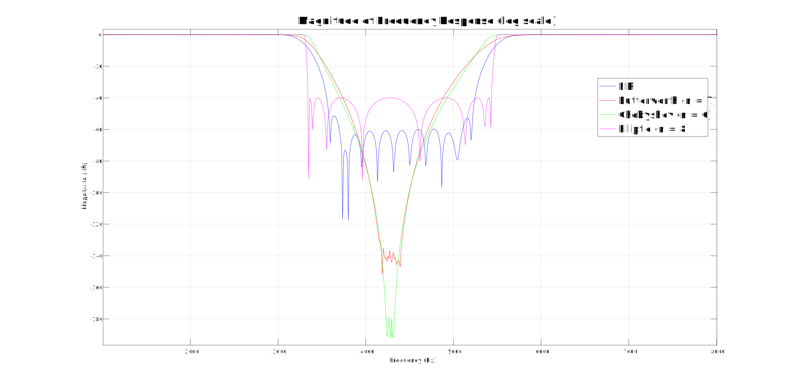

# CMPE 362 HOMEWORK 3 - Noise Removal using Digital Filters
* **Muhammet Emin Çiftçi, 2020400081**

## 1. Analysis of the Original Audio
The original audio (sample.wav) file includes a part of a mathematics lecture that has been corrupted with noise. In order to understand and erase this noise, we need to analyze the spectrogram of the audio and audio itself too. 

After listening to the sound, we can easily detect that there is an background noise that is constantly playing. Also, when we look at the spectrogram of the original audio, it looks like this:

The spectrogram indicates that there is a sound even when the person in the audio file does not speak. That means, there is a digital noise that corrupted the audio file. In the image between 4 kHz and 5 kHz area, the noise can be detected. It is always present. To be safe, we will select our f1 value as 3800 Hz and f2 value as 5000 Hz.

## 2. FIR Bandstop Filter
By using **fir1()** function in Matlab, we will design a 256th-order FIR bandstop filter. As parameters, we will give f1 - 500 (3300) and f2 + 500 (5500) as cutoff frequencies. We expect to almost erase the noise from the audio. By checking the audio file named **fir_filtered.wav** under the folder **audio-files**, we can see that the noise is totally erased. Also we can check the resulting spectrogram after the filtering process:

## 3. IIR Bandstop Filters
By using **butter()**, **cheby1()**, and **ellip()** functions, we will desing Butterworth, The Chebyshev Type 1, and Elliptic IIR bandstop filters to see if they can erase the noise. The frequency range (cutoff frequencies) will be the same as the previous step. 

For this part, a new parameter **n** is introduced. The value of n represents the order of the filter, which means the number of zeros and poles used in filter's design. The lesser the value of n, the gentler the transition and the weaker the attenuation. The higher the value of n, the sharper the transition between passband and stopband. Also, the possibility of unstablity increases as the n increase. Overshooting happens and corruption of the audio file is the result. Therefore, choosing the correct n is a very important task.

Starting from the value 3, step by step various values of n have been tried. The first values of n where the noise reduction happened significantly were different for each IIR filter. 

### 3.1 Butterworth IIR Bandstop Filter
For the Butterworth IIR filter, noise disappeared when the value of n became 7 and the filtered audio kept its stability to the value 12. You can find the resulting audio file on this location: **audio-files/iirbutterworth_filtered.wav**. When the value became 13, the audio got corrupted and a bip sound was the only thing that could be heard from it. The spectrograms for n = 7 and n = 13 are:

From the first image, we can see that noise is almost totally erased. From the second image, we can see that the frequencies got totally corrupted and nothing is the same as the original audio spectrogram.

### 3.2 The Chebyshev Type 1 IIR Bandstop Filter
For the Chebyshev IIR filter, noise disappeared when the value of n became 6 and the filtered audio kept its stability to the value 11. You can find the resulting audio file on this location: **audio-files/iircheby_filtered.wav**. When the value became 12, the audio got corrupted and a bip sound was the only thing that could be heard from it. The spectrograms for n = 6 and n = 12 are: 

From the first image, we can see that noise is almost totally erased. From the second image, we can see that the frequencies got totally corrupted and nothing is the same as the original audio spectrogram. 

### 3.2 Elliptic IIR Bandstop Filter
For the Elliptic IIR filter, noise disappeared when the value of n became 8 and the 9. You can find the resulting audio file on this location: **audio-files/iirelliptic_filtered.wav**. When the value became 10, the audio got corrupted and a bip sound was the only thing that could be heard from it. The spectrograms for n = 8 and n = 10 are:

From the first image, we can see that noise is almost totally erased. From the second image, we can see that the frequencies got totally corrupted and nothing is the same as the original audio spectrogram. 

## 4. Frequency Responses
Frequency responses of the filters on their minimum possible n values for noise reduction can be seen on the below graph. The n values for Butterworth, Chebyshev, and Elliptic filters are 7, 6, and 8 respectively. These value were found by trying from value 3 to 15. 

As we can see from the plot, filters behave as expected between the frequecy cutoff region. 

Frequency responses of the filters when their n values exceed their maximum stable values can be seen on the below graph. The n values for Butterworth, Chebyshev, and Elliptic filters are 12, 11, and 10 respectively. Again these values found by trying from 15 to 9. The first values when the audio got corrupted were these. 

As we can see from the plot, other that FIR filter all the filters behave unexpectedly due to their n values. 

## 5. Zero Pole Plots
The zero pole plots of the IIR filters are also included in this report. We can see the graph for the minimum n values for each IIR filter on the below graph:

The n values are 7, 6, and 8 respectively.

Also we can see the graph for minimum n values for instability for each IIR filter on the below graph:

The v values are 12, 11, and 10 respectively. We can see the unexpected behaviour of zeros.

